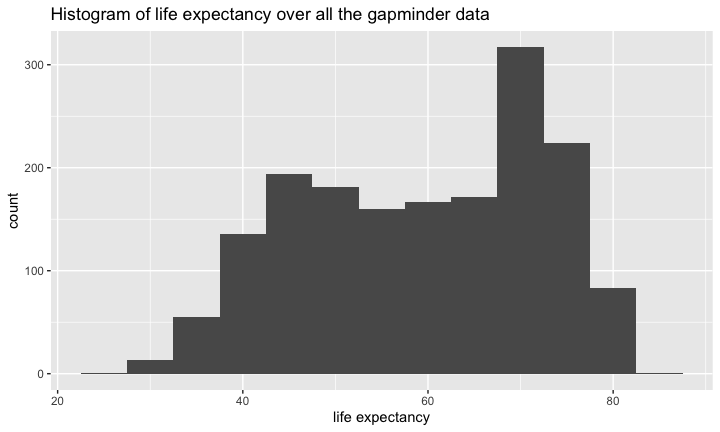
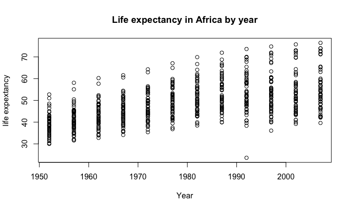

# A look at gapminder 

## This is a summary of the data:

```
##         country        continent        year         lifeExp     
##  Afghanistan:  12   Africa  :624   Min.   :1952   Min.   :23.60  
##  Albania    :  12   Americas:300   1st Qu.:1966   1st Qu.:48.20  
##  Algeria    :  12   Asia    :396   Median :1980   Median :60.71  
##  Angola     :  12   Europe  :360   Mean   :1980   Mean   :59.47  
##  Argentina  :  12   Oceania : 24   3rd Qu.:1993   3rd Qu.:70.85  
##  Australia  :  12                  Max.   :2007   Max.   :82.60  
##  (Other)    :1632                                                
##       pop              gdpPercap       
##  Min.   :6.001e+04   Min.   :   241.2  
##  1st Qu.:2.794e+06   1st Qu.:  1202.1  
##  Median :7.024e+06   Median :  3531.8  
##  Mean   :2.960e+07   Mean   :  7215.3  
##  3rd Qu.:1.959e+07   3rd Qu.:  9325.5  
##  Max.   :1.319e+09   Max.   :113523.1  
## 
```

 

## What variables do we have?

```
## [1] "country"   "continent" "year"
```

```
## [1] "lifeExp"   "pop"       "gdpPercap"
```


## Now looking closer at life expectancy:
<!-- -->


## This is the mean over all countries for all years:

```
## [1] 59.47444
```


## Africa

Now we'll look briefly at gapminder data for Africa.
<!-- -->


## **These are the *summary statistics* for Africa:**

### population:

```
##      Min.   1st Qu.    Median      Mean   3rd Qu.      Max. 
##     60011   1342075   4579311   9916003  10801490 135031164
```
### life expectancy:

```
##    Min. 1st Qu.  Median    Mean 3rd Qu.    Max. 
##   23.60   42.37   47.79   48.87   54.41   76.44
```

--- 

### GDP per capita:

```
##    Min. 1st Qu.  Median    Mean 3rd Qu.    Max. 
##   241.2   761.2  1192.1  2193.8  2377.4 21951.2
```


